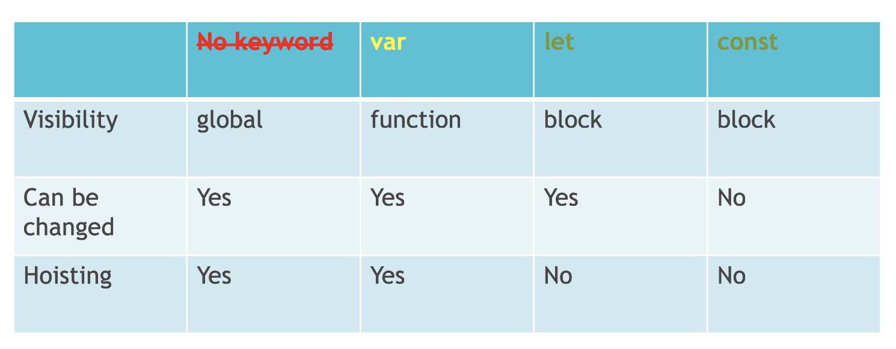

# Variables and Data Types
_December 25 2024_

## var
var "a" is declared and hoisted to the top of its scope (the function variableExamples). Its initial value is undefined before the assignment.

The var "a" inside the "if" block is the same variable as the one declared outside because var is function-scoped.

After reassigning a within the "if" block, its value is changed throughout the function scope.

## let
let "b" is declared within the block and not accessible before its declaration, resulting in a "ReferenceError".

The let "b" inside the "if" block is a different variable from the one outside because let is block-scoped.

Each let "b" maintains its value within its respective block scope.

## const
const "c" behaves similarly to let in terms of scope and hoisting.

const also throws a ReferenceError if accessed before declaration.

The const "c" inside the "if" block is a different variable from the one outside.

const guarantees that the variable cannot be reassigned, ensuring immutability within its scope.
